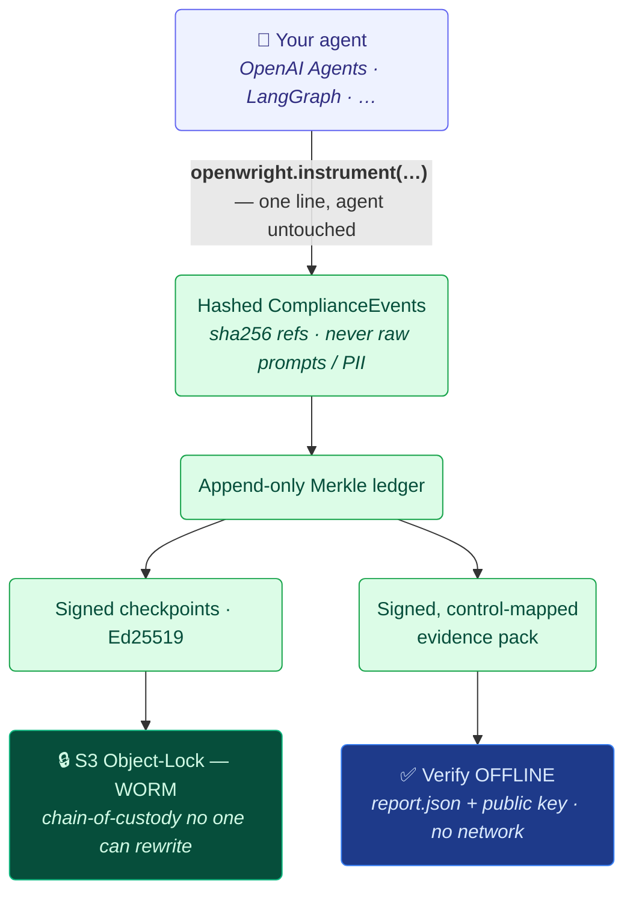

<h1 align="center">🔏 OpenWright</h1>

<p align="center"><b>The Agent Evidence Layer</b> — turn any AI agent's runtime behavior into
signed, tamper-evident, control-mapped audit evidence, verifiable offline by anyone.</p>

<p align="center">
  <a href="https://pypi.org/project/openwright-core/"></a>
  <a href="https://pypi.org/project/openwright-core/"></a>
  <a href="LICENSE"></a>
  <a href="https://github.com/allthingsN/openwright/actions/workflows/ci.yml"></a>
  <a href="https://codecov.io/gh/allthingsN/openwright"></a>
</p>

<p align="center">
  <b><a href="docs/">Docs</a></b> ·
  <b><a href="https://github.com/allthingsN/openwright-examples">Examples</a></b> ·
  <b><a href="https://github.com/allthingsN/openwright-connectors">Connectors</a></b> ·
  <b><a href="https://pypi.org/project/openwright-core/">PyPI</a></b> ·
  <b><a href="docs/COMPLIANCE_BOUNDARY.md">Boundary</a></b>
</p>

---



OpenWright sits on top of your existing agent + OpenTelemetry instrumentation, **forks a
copy** of the runtime behavior (tool calls, handoffs, decisions, approvals), and turns it
into **append-only, signed, tamper-evident records mapped to regulatory controls** (EU AI
Act, SOC 2, ISO 42001, NIST AI RMF, GDPR). The evidence is **verifiable by any third party**
with just a public key — no access to your data, prompts, or infrastructure.

> [!IMPORTANT]
> **OpenWright produces _evidence that controls were exercised_. It does NOT assert legal
> compliance, certification, conformity assessment, or an audit opinion** — those are
> reserved for qualified auditors, notified bodies, and counsel. The boundary is enforced in
> code (every artifact carries it). See [docs/COMPLIANCE_BOUNDARY.md](docs/COMPLIANCE_BOUNDARY.md).

## Quick start

```bash
pip install openwright-core openwright-openai-agents
export OPENWRIGHT_CHECKPOINT_STORE="s3://your-bucket/checkpoints?lock=COMPLIANCE&days=180"  # or file://./out/cp
```

Add **one line** to your agent — capture is automatic, the agent code is untouched:

```python
import openwright
openwright.instrument("openai-agents", decision_tools=["update_seat"])   # captures every tool call/handoff

# ... your normal agent run, e.g. await Runner.run(agent, messages) ...

openwright.get_runtime().report(out_dir="out")    # emit the signed evidence pack (out_dir may be s3://)
```

Then anyone can verify it **offline**, no network or infra:

```bash
openwright verify out/report.json --pubkey out/public_key.pem --deep
```

Try the full before/after on real agents: **[openwright-examples](https://github.com/allthingsN/openwright-examples)**
(OpenAI Agents SDK customer-service + a 6-agent financial-research pipeline).

## What you get

- **Signed, append-only Merkle log** of every tool call, handoff, decision, and approval.
- **Hashes only** (`sha256:` references) — raw prompts/PII never enter the ledger.
- **WORM chain-of-custody** — signed checkpoints to S3 Object-Lock (COMPLIANCE) that not even
  the account root can rewrite.
- **Control-mapped, deep-verifiable verdicts** — verdicts are *re-derived from the evidence*
  (a forged "satisfied" is rejected even if re-signed), across **three honest states**:
  `satisfied` / `not_satisfied` / `insufficient_evidence`.
- **Offline, dependency-light verifier** — needs only the report + a public key (no DB, no
  network); a pure-Python build runs in the browser via WebAssembly.
- **One-line, framework-native integration** via connectors (OpenAI Agents SDK, LangGraph, …),
  storage backends (Postgres, S3), and exporters (GitHub Action / SARIF, Langfuse).

## How it works

1. **Capture** — `instrument()` registers a global processor (or use the SDK directly) that
   maps runtime events to a canonical `ComplianceEvent`. Capture is asynchronous and additive:
   it can never block or break your agent, and never touches your primary telemetry.
2. **Ledger** — events append to a tamper-evident Merkle log (`file`, SQLite, or Postgres).
3. **Checkpoint** — signed tree heads (Ed25519) are sealed to a WORM checkpoint store (S3).
4. **Map** — events are evaluated against published, content-hashed **crosswalks** (EU AI Act,
   SOC 2, ISO 42001, NIST AI RMF, GDPR) into control verdicts.
5. **Verify** — a signed evidence pack is independently verifiable offline; deep verification
   re-derives the verdicts from the evidence.

See [docs/ARCHITECTURE.md](docs/ARCHITECTURE.md), [docs/SECURITY.md](docs/SECURITY.md),
[docs/SCALABILITY.md](docs/SCALABILITY.md), and the [whitepaper](docs/WHITEPAPER.md).

## Ecosystem

| Repo | What |
|---|---|
| **openwright** (this repo) | core: events, ledger, Merkle, signing, crosswalks, verifier, CLI, `instrument()` |
| [openwright-connectors](https://github.com/allthingsN/openwright-connectors) | source connectors (LangGraph, OpenAI Agents), storage (Postgres, S3), exporters (GitHub Action, Langfuse) |
| [openwright-examples](https://github.com/allthingsN/openwright-examples) | runnable before/after examples on real agents |

## Contributing

Contributions are welcome — connectors, crosswalks, and fixes. See **[CONTRIBUTING.md](CONTRIBUTING.md)**.

## License

[Apache-2.0](LICENSE).
