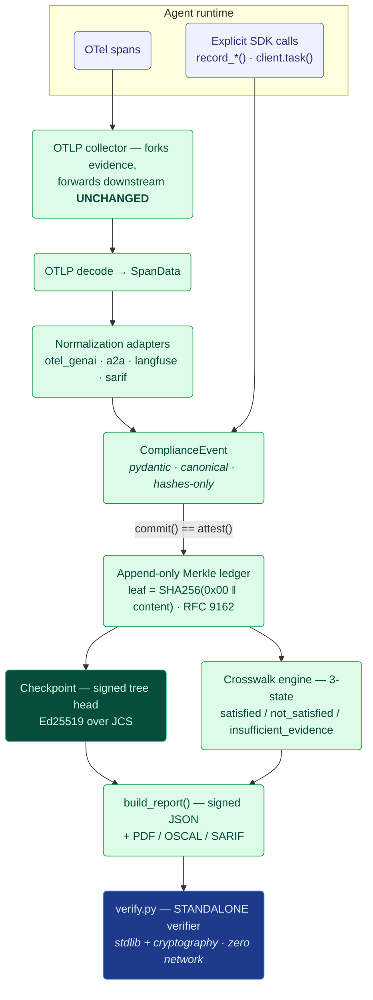

# OpenWright Architecture

OpenWright v0.1 is an Agent Evidence Layer: it converts AI-agent runtime behavior into signed, tamper-evident, control-mapped audit evidence. This document describes the system as built — its data flow, the canonical event model, the Merkle attestation design, adapter isolation, the declarative crosswalk engine, the report format, and the standalone verifier.

A hard boundary runs through the entire design: **OpenWright produces evidence that controls were exercised; it does not assert legal compliance, certification, or an audit opinion.** Every report carries an explicit boundary statement, and the crosswalk engine reports control *status* over collected evidence rather than a pass/fail compliance verdict.

## 1. End-to-End Data Flow

There are two entry points into the system: passive ingestion of OpenTelemetry traces emitted by an instrumented agent, and the active SDK that an agent author calls to record discrete compliance-relevant facts (human approvals, risk classifications, policy decisions, incidents, decisions). Both converge on the same canonical `ComplianceEvent`, the same append-only Merkle ledger, and the same signed report.

The evidence path is strictly additive (NFR-REL-01): in the collector, the original OTLP bytes are forwarded to the configured downstream backend unchanged, and the evidence fork runs separately. A failure, slowdown, or malformed span in the evidence path can never drop, delay, or alter primary telemetry. Inside the pipeline, a single background worker thread drains a bounded queue; submission is non-blocking; malformed spans are counted rather than fatal; and drops are logged rather than silently discarded.

## 2. The Canonical ComplianceEvent and Why Determinism Matters

`events.py` defines `ComplianceEvent`, a pydantic model with structured sub-models (`Actor`, `Provenance`, `IORef`, `ModelInfo`, `ToolInfo`, `Oversight`, `Risk`, `SourceMeta`, `LedgerFields`, `IdentityClaim`) and enums (`EventKind`, `OversightStatus`). The model sets `extra="allow"` for forward-compatibility (DR-04): unknown fields produced by future schema versions are preserved rather than rejected.

The event is hashed, and hashing must be reproducible byte-for-byte across machines, languages, and time. That is the job of `canonical.py`, which implements a deterministic canonical JSON encoding — an RFC 8785 / JCS-compatible subset:

- keys are sorted;
- no insignificant whitespace;
- UTF-8 output;
- `None` values are omitted;
- **floats are forbidden** — there is no portable, deterministic float serialization, so the model carries no floats (for example, monetary cost is a decimal *string*, and token counts are integers).

Timestamps use `to_rfc3339()` with fixed-nanosecond precision so that the same instant always serializes to the same bytes. `hash_payload()` returns `"sha256:<hex>"`. This determinism requirement (FR-NRM-04) is what makes the whole evidence chain meaningful: if two parties canonicalize the same logical event, they must get identical bytes and therefore identical hashes.

Two derived properties anchor identity and attestation:

- **`event_id`** is deterministic: `"evt_" + sha256(content_for_id)[:40]`. The same logical event always yields the same id.
- **`leaf_content()`** returns the event content *excluding* the `LedgerFields` block. The Merkle leaf is computed over event content, not over ledger bookkeeping (leaf index, commit time, retention), so the attested content is the substantive event itself.

## 3. Merkle Attestation Design

`merkle.py` implements the RFC 6962 / RFC 9162 Merkle tree algorithms using only the standard library (`hashlib`):

- **leaf hash** = `SHA256(0x00 || data)`
- **interior node hash** = `SHA256(0x01 || left || right)`
- **empty tree** = `SHA256("")`

The `0x00` / `0x01` domain-separation prefixes are essential: they prevent second-preimage attacks in which an interior node is presented as a leaf (or vice versa). The module provides `tree_hash`, `inclusion_proof` and `consistency_proof` generation, and the corresponding `verify_inclusion` (RFC 9162 §2.1.3.2) and `verify_consistency` (RFC 9162 §2.1.4.2). The implementation is validated against the Google Certificate Transparency reference vectors in the test suite (tree roots for n=0..8, plus inclusion and consistency proofs).

A **Checkpoint** (`signing.py`) is a signed tree head: an Ed25519 signature over the canonical `{origin, root_hash, timestamp, tree_size}`. It is the public, portable commitment to the state of the log at a given size. **Inclusion proofs** demonstrate that a specific event leaf is contained in the tree under a given signed root. **Consistency proofs** demonstrate that a newer, larger tree is an append-only extension of an older one — that nothing previously committed was removed or rewritten.

### Why committing an event is the same as attesting it (atomicity)

In `ledger.py`, `commit()` is the single operation that finalizes an event and admits it to the log. It:

1. finalizes the event `id`,
2. computes the `leaf_hash` directly from the event's `leaf_content()`,
3. assigns `leaf_index`, `committed_at`, and `retention_until`,
4. appends to the backend, and
5. updates the in-memory leaf-hash list that the Merkle root is derived from.

Because the leaf hash is computed from the event content as part of commit, **there is no window in which an event is recorded but not yet attested.** Committing *is* attesting — the act of writing the event is the act of binding its hash into the tree. This is how the atomicity requirement (NFR-REL-02) holds: you cannot have a committed-but-unattested event, nor an attested-but-uncommitted one.

The ledger is append-only by contract. `LedgerBackend` is an ABC with no edit or delete operation. `InMemoryLedgerBackend` and `FileLedgerBackend` (JSON-Lines, `fsync` per append, heals a torn trailing line on open) are the provided implementations. The orchestrator is thread-safe via a lock, because the ingest worker thread and SDK `commit()` calls can run concurrently. The orchestrator exposes `root()`, `inclusion_proof_hex()`, `consistency_proof_hex()`, `checkpoint()`, and `prove_retention()`. Corrections are first-class but never mutate history: `correct()` records a *new* event (FR-LED-01).

### Signing and key custody

`signing.py` is built on Ed25519. The `KeySource` ABC exposes `sign()` and `public_key_raw()`; provided implementations are `InMemoryKeySource`, `FileKeySource` (PEM file), and `EnvKeySource` (PEM in an environment variable). A KMS or HSM is supported by implementing the same ABC — `sign()` delegates to the device and the private key never leaves it. The `key_id` is `"ed25519:" + sha256(pubkey)[:32]`. Private keys are never logged or persisted by OpenWright (NFR-SEC-02).

### Identity binding

`identity.py` closes a verified gap: A2A AgentCards are descriptive and, by default, not cryptographically bound (AgentCard signing is optional, JWS per RFC 7515). `make_identity_claim` / `verify_identity_claim` create and check an Ed25519 `IdentityClaim` over the JCS-canonical AgentCard with the `signatures` field excluded, following the A2A signing rule (FR-ATT-07).

## 4. Adapter Isolation (FR-NRM-03)

The OpenTelemetry GenAI semantic conventions are still Experimental ("Development"), so attribute names churn. OpenWright isolates that churn behind normalization adapters that share a proto-agnostic `SpanData` dataclass (`adapters/base.py`):

- **`otel_genai.py`** maps `gen_ai.*` attributes and centralizes the attribute names so a convention rename is a one-line change. It supports both current and legacy names: `gen_ai.provider.name | gen_ai.system`, `gen_ai.usage.input_tokens | prompt_tokens`, `output_tokens | completion_tokens`; `finish_reasons` are coerced to a list. There is no cost attribute in the conventions, so **cost is derived from a pricing table as a decimal string** (consistent with the no-floats rule).
- **`a2a.py`** reconstructs provenance. An A2A `Task` has `id` and `contextId` but no parent field, so parent and root are *reconstructed* from `Message.referenceTaskIds` and `contextId`. This derivation is documented as OpenWright-derived rather than presented as native A2A data.
- **`langfuse.py`** maps `langfuse.*` attributes, which take precedence over `gen_ai.*` (FR-ING-06).
- **`sarif_in.py`** ingests SARIF findings as `conformance_finding` events with defensive parsing.
- **`receipt.py`** consumes externally-produced signed action receipts (Ed25519). It **verifies the receipt signature before ingest** and normalizes it into a `tool_call` event, so OpenWright sits *on top of* an interchangeable receipt primitive (other formats plug in behind the same `ReceiptSource` interface) rather than reinventing it.

Because the substantive mapping lives in adapters and all downstream stages consume only `ComplianceEvent`, a semantic-convention change is contained to a single adapter and does not ripple into the ledger, crosswalk, or report.

The ingestion plumbing sits in `ingest/`: `otlp_common.py` is the only module that imports `opentelemetry-proto` and decodes OTLP protobuf into `SpanData`; `pipeline.py` is the bounded-queue background worker (`EvidencePipeline`); `fanout.py` (`Forwarder`) POSTs the original bytes unchanged to a downstream OTLP/HTTP backend using stdlib `urllib`; `http_server.py` (`EvidenceCollector`) serves `POST /v1/traces` for `application/x-protobuf` `ExportTraceServiceRequest`, forks evidence and forwards downstream unchanged, with a `MockOTLPBackend` for tests; `grpc_server.py` exposes `serve_grpc` with a lazy `grpcio` import.

## 5. The Three-State Crosswalk Engine

`crosswalk.py` is a declarative evaluation engine. **No control logic is hard-coded; controls are pure data** (FR-MAP-01). The models are `EventFilter`, `Condition`, `Control`, and `Crosswalk`. A `Condition` is one of a small, composable set:

- types: `committed`, `field`, `linked`, `any_of`, `all_of`, `not`;
- link kinds: `approval_ref`, `same_task`, `same_context`, `references_root`.

`evaluate()` returns a three-state `ControlStatus` per control:

- **`SATISFIED`** — evidence in scope meets the control's conditions;
- **`NOT_SATISFIED`** — evidence in scope contradicts the control;
- **`INSUFFICIENT_EVIDENCE`** — there is not enough evidence to judge.

An **empty scope yields `INSUFFICIENT_EVIDENCE` by default and is never collapsed into `NOT_SATISFIED`** (FR-MAP-07). This three-state distinction is central to the evidence-versus-compliance boundary: "we have no evidence" is not the same claim as "the control failed," and the engine refuses to conflate them.

Crosswalks are loaded by `crosswalk_loader.py` via `load_builtin("eu-ai-act" | "soc2")` or `load_crosswalk_file(path)`. The built-in EU AI Act crosswalk (`crosswalks/eu_ai_act.yaml`, v1.0.0) covers Articles 12, 13, 14, 26, 27, and 73 with primary-source citations (article, paragraphs, URL, quote, effective_date); `soc2.yaml` covers CC7.2. Each crosswalk is independently versioned (FR-MAP-05) and changes are tracked in `CHANGELOG.md`.

### Regulatory note (as of 2026-05-28)

The EU AI Act is Regulation (EU) 2024/1689. High-risk Chapter III obligations apply from **2 August 2026** under the enacted text. A "Digital Omnibus" provisional agreement (6-7 May 2026) would defer Annex III standalone high-risk obligations to 2 December 2027, but it is **not yet adopted or published**, so 2 August 2026 legally stands. OpenWright's crosswalk cites the enacted dates; this caveat is surfaced here rather than baked into a compliance claim — again consistent with the boundary that OpenWright reports evidence, not legal compliance.

## 6. The Signed Report

`report.py` assembles a signed JSON report with `build_report()`. The **entire report is Ed25519-signed**, so the computed control results are themselves tamper-evident — a recipient cannot alter the conclusions without breaking the signature. The report contains:

- the **checkpoint** (signed tree head);
- per-event records: the event in **hash-only** form, plus `leaf_index`, `leaf_hash`, and an `inclusion_proof`;
- controls with their primary-source citations;
- a summary;
- the explicit `BOUNDARY_STATEMENT`.

Export renderers are provided alongside JSON:

- `render_pdf` (reportlab);
- `to_oscal` — OSCAL 1.1.3 assessment-results. Because OSCAL has no native "insufficient" state, `INSUFFICIENT_EVIDENCE` maps to `not-satisfied` with `reason=other` plus a `openwright-status` property that **preserves the true tri-state**;
- `to_sarif` — SARIF 2.1.0 gap findings.

The pydantic-derived JSON Schemas are generated in `spec.py` (`compliance_event_schema()` / `crosswalk_schema()`) and published under `schemas/` (AC-07).

## 7. Trust Model and the Standalone Verifier

The root of trust is the **standalone verifier** in `verify.py` (FR-VER). It is deliberately minimal and dependency-light: it imports **only** the standard library, `canonical.py`, `merkle.py`, and `cryptography`. It does **not** import pydantic, pyyaml, reportlab, or any network library. This matters because a verifier you cannot easily audit is not a root of trust; keeping its surface tiny means a third party can read it end to end and convince themselves it is sound.

`verify_report()` performs the full chain of checks:

1. verifies the **report signature**;
2. verifies the **checkpoint signature**;
3. recomputes each **event leaf from its hash-only content**;
4. checks each **inclusion proof against the signed root**;
5. recomputes the **full-tree root** and confirms it matches;
6. confirms that **cited evidence events are present**.

It then reports validity, control results, and gaps. Verification uses **zero network** (FR-VER-02) and **needs no raw payloads** (FR-VER-05) — only hashes and proofs — so evidence can be verified without exposing the underlying agent inputs or outputs. `verify_consistency_between()` checks append-only consistency between two checkpoints (FR-ATT-03).

Two consequences of this design:

- The mechanism is a **signed Merkle log, with no blockchain or DLT dependency** (FR-ATT-09).
- Because the report is hash-only and signed, and the verifier is offline and payload-free, the party producing evidence and the party checking it need share nothing but the public key, the report, and the verifier source.

## 8. Developer Surfaces

`sdk.py` provides `EvidenceClient` with `record_human_approval`, `record_risk_classification`, `record_policy_decision`, `record_incident`, and `record_decision`; `client.task()` is a context manager that sets ambient A2A provenance. The SDK hashes raw payloads automatically — the developer never touches hashing, signing, or Merkle internals (FR-SDK-04). The `high_risk_decision` decorator wraps a high-risk decision call site (FR-SDK-03).

`cli.py` exposes a Typer CLI (entry point `openwright`) with commands: `version`, `demo`, `verify`, `gate`, `report`, `schema`, `crosswalks`, `keygen`, and `collector`. The `gate` command is for CI/CD: it exits 1 if a required control is unsatisfied and exits 2 if verification fails, and supports `--sarif-out`.

`demo.py` (`run_demo()`) exercises the whole system end to end: a loan-decisioning agent emits real OTel SDK spans over OTLP/HTTP to the collector, which forks evidence and fans out to a mock backend unchanged; the SDK records approvals, a risk classification, and a FRIA; one decision is left deliberately unapproved; the EU AI Act crosswalk is evaluated; the report is signed and exported (JSON + PDF + OSCAL + SARIF); the report is verified offline; and tamper detection is demonstrated.

## Module Reference

| Module | Responsibility |
| --- | --- |
| `canonical.py` | Deterministic canonical JSON (JCS subset, sorted keys, no whitespace, `None` omitted, floats forbidden); SHA-256 helpers; `hash_payload()`; fixed-nanosecond RFC 3339 timestamps. |
| `events.py` | `ComplianceEvent` pydantic model and sub-models; deterministic `event_id`; `leaf_content()` excludes ledger block; `extra="allow"`. |
| `merkle.py` | RFC 6962 / RFC 9162 Merkle tree; leaf/node domain separation; inclusion and consistency proof generation and verification; stdlib-only. |
| `signing.py` | Ed25519 signing; `KeySource` ABC (in-memory, file, env; KMS/HSM via the ABC); signed `Checkpoint` tree head; no private-key logging. |
| `ledger.py` | Append-only `LedgerBackend` ABC (in-memory, file/JSON-Lines); `commit()` finalizes and attests atomically; thread-safe; proofs, checkpoints, retention, corrections-as-new-events. |
| `crosswalk.py` | Declarative three-state evaluation engine; controls are pure data; empty scope is insufficient, never not-satisfied. |
| `crosswalk_loader.py` | `load_builtin` / `load_crosswalk_file`. |
| `crosswalks/` | EU AI Act v1.0.0 (Arts 12, 13, 14, 26, 27, 73) and SOC 2 CC7.2 YAML with citations; `CHANGELOG.md`; independently versioned. |
| `identity.py` | AgentCard identity binding via Ed25519 over JCS-canonical card (`signatures` excluded); `make_identity_claim` / `verify_identity_claim`. |
| `sdk.py` | `EvidenceClient` (`record_*`), `client.task()` ambient provenance, automatic payload hashing, `high_risk_decision` decorator. |
| `report.py` | `build_report()` signed JSON report (hash-only events, proofs, citations, summary, boundary statement); `render_pdf`, `to_oscal`, `to_sarif`. |
| `verify.py` | Standalone, dependency-light root of trust; offline, payload-free verification of signatures, leaves, inclusion proofs, full root, and citations; `verify_consistency_between()`. |
| `spec.py` | JSON Schemas generated from the pydantic models; published under `schemas/`. |
| `adapters/` | `base.py` (`SpanData`), `otel_genai.py`, `a2a.py`, `langfuse.py`, `sarif_in.py`, `policy.py`, `receipt.py` (verify external signed receipts → `tool_call`); isolate format churn (FR-NRM-03). |
| `ingest/` | `otlp_common.py` (OTLP decode), `pipeline.py` (bounded-queue worker), `fanout.py` (`Forwarder`), `http_server.py` (`EvidenceCollector`), `grpc_server.py` (`serve_grpc`). |
| `cli.py` | Typer CLI (`openwright`): `version`, `demo`, `verify`, `gate`, `report`, `schema`, `crosswalks`, `keygen`, `collector`. |
| `demo.py` | `run_demo()` end-to-end loan-decisioning walkthrough including tamper detection. |

---

**Boundary.** OpenWright produces cryptographically verifiable *evidence* that specified controls were exercised, mapped to cited regulatory sources. It does not assert legal compliance, issue a certification, or render an audit opinion. The three-state crosswalk engine, the explicit report boundary statement, and the regulatory caveat above all exist to keep that distinction intact.