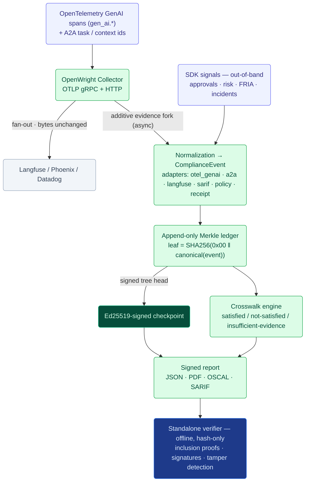

# OpenWright — The Agent Evidence Layer

### A white paper on turning AI-agent runtime behavior into signed, tamper-evident, control-mapped audit evidence

**Version:** v0.1 (technical preview)
**Date:** 31 May 2026
**Status:** Open-source core (Apache-2.0); pre-launch; crosswalks pending qualified legal/standards review.

> **A note on naming.** The product is **OpenWright**. Its code, package, CLI, and repository still carry the prior working name `openwright` (lowercase) — which is why the commands in this paper read `openwright …` — and will be renamed once the namespace (domain, PyPI/npm, GitHub org) is registered. The schema `$id` is effectively permanent, so we register the namespace first and rename the code once. "OpenWright" and the `openwright` package are the same product.

---

## Abstract

Turning an AI agent's *runtime behavior* into **cryptographically verifiable, control-mapped, tamper-evident evidence packages designed to support audit review** is a contested space, not an empty one. It is split between two camps: workflow-level **governance suites** (Credo AI, Holistic AI, Vanta, OneTrust, IBM watsonx.governance) that generate framework-mapped evidence but no cryptography, and **cryptographic-audit** tools (Merkleon, DCL/Leibniz Layer, VeritasChain, Prismer, OpenFang) that produce tamper-evident receipts but little regulatory-crosswalk depth. The unoccupied cell is the *intersection*: an open-source, OpenTelemetry-native layer that does both. Telemetry is abundant; cryptographically-verifiable evidence *mapped to a reviewed regulatory control* is not.

OpenWright occupies that intersection. It sits on top of existing OpenTelemetry and A2A instrumentation, **forks a copy** of an agent's runtime behavior without touching the primary pipeline, normalizes it into a single canonical event model, commits it to an append-only Merkle log with Ed25519-signed checkpoints, maps it against versioned, primary-source-cited regulatory crosswalks, and emits a signed evidence pack (JSON, PDF, OSCAL, SARIF) that **any third party can verify offline, with no access to the producer's data, prompts, or infrastructure.**

OpenWright produces *evidence that controls were exercised*. It does **not** assert legal compliance, certification, or an audit opinion — that boundary is enforced in code and is non-negotiable. This document describes the problem, the architecture, the trust model (including, honestly, what the system does **not** defend against), the strategic position, the business model, and the roadmap.

---

## 1. The problem

### 1.1 Regulation arrived faster than evidence tooling

The EU AI Act (Regulation (EU) 2024/1689) imposes obligations on high-risk AI systems with penalties of up to **€35M or 7% of global turnover**. Several obligations are directly about *records of what the system did* — among them Article 12 (automatic event logging over the system's lifetime), Article 14 (demonstrable human oversight of high-risk decisions), and Article 73 (defensible serious-incident records).

**The timeline is in motion, and we state it precisely.** The "Digital Omnibus" deferral is the **operative date this cycle**: the high-risk (**Annex III**) obligation package — including Articles 12, 14, and 73 *as a whole*, not a hand-picked subset — now lands on **2 December 2027** (embedded/Annex I systems to 2 Aug 2028), replacing the original conditional-trigger mechanism with fixed calendar dates. What did *not* move are the **near-term hooks**: **Article 50** transparency / synthetic-content-marking obligations and **Article 6(3)** (the high-risk registration/exemption logic) remain on their original near-term timing, and GPAI model obligations carry enforcement powers from the same near-term date. OpenWright surfaces this status in the crosswalk rather than hard-coding a date a customer would have to trust, and we re-verify the operative dates against the **Official Journal** rather than treat any single press date as final.

The deferral is, counterintuitively, useful: it removes false urgency and creates runway to build the two things that are actually defensible (§14).

The Act is not unique. NIST AI RMF, ISO/IEC 42001, SOC 2, and GDPR Article 22 all demand demonstrable, record-backed control of automated decisions. The common shape of every one of these obligations is the same: *prove, with records, that a control was exercised.*

### 1.2 Telemetry ≠ evidence

Organizations deploying agents already emit enormous telemetry. But telemetry is the wrong artifact for an auditor:

- It is **mutable** — a log line can be edited after the fact, and nothing detects it.
- It is **unmapped** — a span says `gen_ai.completion`, not "Article 14 human oversight was exercised."
- It is **un-attributable** — it carries no cryptographic proof of *who* recorded it or *that it wasn't altered.*
- It is **privacy-hostile** — it usually contains the very prompts and PII an auditor must not be handed.

The missing artifact is *evidence*: integrity-protected, control-mapped, attributable, and privacy-preserving. That is the translation layer OpenWright owns.

### 1.3 Why now, and where the wedge actually is

The technical substrate (OpenTelemetry GenAI, A2A, signed receipts) only stabilized recently, and regulation across regimes is converging on the same demand: *prove, with records, that a control was exercised.* But the buyer's urgency is no longer a single imminent deadline — it is the structural, multi-regime need, on a runway that now extends to the operative 2 December 2027 high-risk date. The wedge is therefore not urgency; it is the **intersection** itself: being the one open-source, OpenTelemetry-native, cryptographically-verifiable layer whose crosswalks a qualified specialist has reviewed. The control mapping — legal-adjacent and slow to build credibility in — is precisely the part no observability vendor wants to own and no crypto-audit tool has. That is the defensible position, and it must be *earned* (a reviewed crosswalk, a design partner, an auditor sign-off), not asserted.

---

## 2. What OpenWright is, in one paragraph

OpenWright is an open-source **evidence layer for AI agents**. It ingests runtime behavior from the instrumentation you already run (OpenTelemetry GenAI spans, A2A task/context ids) plus the evidence telemetry cannot infer (human approvals, risk classifications, FRIA references, incidents) recorded through a thin SDK. It normalizes everything into one versioned `ComplianceEvent`, commits each event to an append-only RFC 6962 Merkle log sealed by Ed25519-signed checkpoints, evaluates declarative regulatory crosswalks to produce **three honest verdicts** per control — *satisfied / not-satisfied / insufficient-evidence* — and emits a signed evidence pack that a dependency-light, **zero-network** verifier can validate offline using only hash-only data. The ledger never stores raw prompts or PII.

---

## 3. Architecture

The evidence path is **strictly additive**. The collector forwards the original OTLP bytes downstream unchanged and forks evidence on a separate, bounded, non-blocking path. A failure anywhere in the OpenWright pipeline can never drop, delay, or alter the customer's primary telemetry — a precondition for any team to adopt it.

### 3.1 Two adoption tiers

- **Tier 1 — zero-code onboarding.** Point `OTEL_EXPORTER_OTLP_ENDPOINT` at the OpenWright collector. Production telemetry keeps flowing to Langfuse/Phoenix/Datadog unchanged; a copy is forked into the evidence ledger. No application code changes.
- **Tier 2 — the SDK.** Record the evidence telemetry can't infer — human approvals, risk classifications, policy decisions, incidents — linked by A2A task id. The developer never touches hashing, signing, or Merkle mechanics; the SDK hashes payloads automatically so raw sensitive data never enters the record.

---

## 4. The canonical event model

Everything reduces to one versioned, source-independent `ComplianceEvent` (published as a JSON Schema). Each source format is isolated behind a single-purpose **adapter**, so an upstream convention change is a one-line edit, never a schema migration. The shipping adapters:

| Adapter | Source | Becomes |
|---|---|---|
| `otel_genai` | OpenTelemetry GenAI spans (`gen_ai.*`) | model invocations, tool calls |
| `a2a` | A2A task/context coordination | task lifecycle events |
| `langfuse` | Langfuse traces | observation events |
| `sarif_in` | SARIF scanner output | conformance findings |
| `policy` | OPA / Cedar policy decisions | formal policy-decision events |
| `receipt` | signed action receipts (Ed25519) | tool-call events (signature verified *before* ingest) |

The model is **deterministic**: identical inputs hash identically. Hashing is computed over a strict canonical-JSON subset (RFC 8785 / JCS — sorted keys, UTF-8, omitted nulls, **floats forbidden**) so no ambiguous numeric can ever enter hashed content. Inputs and outputs are referenced by hash (`sha256:…`), never by raw value.

---

## 5. Tamper-evident attestation

Each committed event becomes a leaf in an append-only **RFC 6962 / 9162 Merkle tree**: `leaf = SHA256(0x00 ‖ canonical(event))`. The tree is periodically sealed by an **Ed25519-signed checkpoint** (a signed tree head over origin, root hash, tree size, and timestamp). From a signed checkpoint and standard proofs, a verifier can establish:

1. **Inclusion** — a specific event was in the tree at a specific size; altering any field breaks its leaf hash.
2. **Consistency** — an earlier tree is a strict prefix of a later one; no past event was deleted, reordered, or inserted.
3. **Report integrity** — the control results themselves are Ed25519-signed, so any post-hoc edit to a *satisfied / not-satisfied / insufficient* outcome is detectable.

The Merkle implementation is incremental (`O(log n)` append and root, frontier of at most `⌈log₂ n⌉` nodes) and has been verified **byte-identical to the recursive reference and to Google CT test vectors** across `n = 0..300` plus a 1,000-event fuzz. This is **not** a blockchain: trust derives from a signed Merkle log plus (optionally) external witnessing, not from a distributed ledger, and OpenWright makes no decentralization claims.

---

## 6. The crosswalk engine and three honest verdicts

A **crosswalk** maps events to controls in versioned, primary-source-cited YAML. No control logic is hard-coded; the engine evaluates declarative predicates. Six crosswalks ship today, each deepened and cited:

| Crosswalk | Controls | Source |
|---|---|---|
| EU AI Act (high-risk subset) | Art. 12/13/14 (in-the-loop *and* on-the-loop variants)/26/27/73 | Regulation (EU) 2024/1689 |
| EU AI Act v1 (narrowed review subset) | Art. 14 oversight, Art. 26 retention | Regulation (EU) 2024/1689 |
| SOC 2 (system monitoring) | CC7.2 and related | AICPA TSC (2017, rev. 2022) |
| NIST AI RMF 1.0 | Govern/Map/Measure/Manage subset | NIST AI 100-1 (Jan 2023) |
| ISO/IEC 42001:2023 | Annex A subset | ISO/IEC 42001:2023, Annex A |
| GDPR (automated decision-making) | Art. 22 and related | Regulation (EU) 2016/679 |

The EU AI Act crosswalk is *deployer-profile-selectable*: Article 14 ships both an **in-the-loop** and an **on-the-loop** oversight variant, and Article 27 FRIA-gating is selectable, so the mapping matches the deployment rather than forcing one oversight model.

The engine never collapses uncertainty into a binary. Every control resolves to one of three states:

- **satisfied** — the recorded evidence meets the testable predicate the crosswalk states for that control;
- **not-satisfied** — the predicate is contradicted by the evidence;
- **insufficient-evidence** — the evidence needed to decide is absent.

The third state is the product's most important honest move. "You have not proven oversight" is a different — and more auditable — claim than "you failed oversight," and it is exactly the distinction an auditor cares about. A "satisfied" result is an *input to a professional's judgment, not a substitute for it.*

**Completeness is self-attesting, not asserted.** We never claim a "complete log." Instead, a gap in the record is made *visible and tamper-evident*: a recorded `evidence_gap` marker downgrades a gap-aware control verdict (e.g. Article 12 record-keeping resolves to *insufficient-evidence*, not *satisfied*, when a gap is present), and on the ingest path overflow is buffered to durable spillover rather than dropped, with any genuinely un-admitted event written to the tamper-evident drop journal. The guarantee is therefore not "the log is complete" but "any incompleteness is attested in the evidence itself" — which is the honest and auditable form of the claim.

---

## 7. The evidence pack and the independent verifier

A signed report is emitted in four formats from one signed source: human-readable **PDF**, machine-readable signed **JSON**, **OSCAL** assessment-results (for GRC tooling), and **SARIF** gap findings (for code-scanning gates). Each carries the compliance-boundary statement (§9).

The **verifier** is the root of trust, and it is deliberately lean: it depends only on the standard library and (optionally) `cryptography` — it ships a pure-Python Ed25519 fallback, so it can verify with **zero third-party dependencies**, including in-browser via WebAssembly (Pyodide, exercised by an automated test). It is **zero-network**: an auditor confirms report-signature validity, checkpoint-signature validity, per-event leaf-hash recomputation, inclusion proofs against the signed root, full-tree-root reconstruction, and that every cited evidence event is present — using only the hash-only report and a trusted public key, **without ever touching the producer's prompts, data, or infrastructure.**

Beyond integrity, `openwright verify --deep` re-derives the **verdicts**: it re-evaluates the report's **content-hash-pinned** crosswalk over the included events and asserts each reported control verdict actually follows from that evidence — and **refuses** if the report's crosswalk content-hash does not match (or is absent). This verifies the *conclusion*, not just the signature and Merkle proofs — offline verdict re-derivation that, to our knowledge, no governance suite or crypto-audit tool offers.

---

## 8. Privacy by default

The ledger stores hashes and pointers, never raw prompts, completions, or business data; private keys are never logged, persisted, or embedded. A complete, verifiable record is producible with **no payloads in the ledger at all**. An optional payload vault can hold raw payloads separately, keyed by the same `sha256:` reference, and scales independently.

We are precise about the limit of this claim: a hash is a *commitment, not encryption.* It protects against incidental disclosure through the evidence record; it is not a defense against an adversary who already holds a candidate plaintext. That honesty is intentional — see the trust model.

---

## 9. The compliance boundary (enforced in code)

OpenWright produces **evidence that controls were exercised**. It does **not** assert legal compliance, certification, conformity assessment, or an audit opinion. Those judgments are reserved for qualified auditors, notified bodies, and counsel. The exact statement embedded in every artifact:

> This report constitutes **EVIDENCE that the listed controls were exercised at runtime**, attested with a tamper-evident Merkle log and an Ed25519 signature. It **DOES NOT constitute legal compliance, certification, conformity assessment, or an audit opinion**. Determinations of compliance are reserved for qualified auditors, notified bodies, and counsel. Crosswalks are maintainer-authored, rigorously cited, and pending qualified legal/standards review.

This is not a footer. The statement is embedded in the signed JSON, rendered in the PDF, placed in the OSCAL `remarks`, repeated in CLI help — and a test **fails the build** if it is ever dropped from any artifact. Each crosswalk additionally carries its own dated `disclaimer` and `reviewed_as_of`, and carries no normative authority of its own; the regulatory text is the source of truth.

---

## 10. Trust model — including what OpenWright does *not* defend against

A product whose entire value is *trustworthy evidence* must be exact about the boundary of its guarantees. OpenWright's core claim is **forensic integrity, not business truthfulness**: it proves "these events were recorded and have not been altered," not "these events describe reality."

**What it guarantees** (given a signed checkpoint distributed before tampering, and a public key obtained through an independent channel): inclusion, consistency, report-result integrity, and atomic commit-and-seal.

**What it does *not* defend against — stated plainly:**

- **A compromised producer signing false events.** An actor controlling a valid signing key and the ingestion path can commit well-formed, fully signed events that misrepresent what the agent actually did. No append-only signed log can detect this; the log faithfully records what it was told. This is the principal residual threat.
- **Key compromise.** All guarantees reduce to custody of the Ed25519 key. With the key, an actor can produce a fresh, internally consistent, fully valid history.
- **Split-view / non-equivocation.** A single OpenWright instance is not a gossiping transparency log; a signer could in principle present different checkpoints to different parties. Each fork is internally valid.
- **Trusting the key from the report itself.** If the verifier takes the public key from the same artifact the producer controls, a fabricated report verifies against its own fabricated key. The key must be published out of band; the CLI warns when verification relies on an embedded key.

**Mitigations that exist (none eliminate the residual threat):** an external checkpoint **witness** that verifies a consistency proof before co-signing (raises the bar to "compromise producer *and* witness"); cryptographic **identity binding** to an A2A AgentCard (makes asserted identity non-repudiable); and **capability-based segregation of duties** separating write, report-generation, checkpoint-signing, and witness roles to limit blast radius.

Stating these boundaries is a feature. For the compliance-evidence buyer, "tamper-evident, producer-attested evidence, verifiable offline by any third party" is the correct and sufficient claim — and a vendor who is precise about it is more credible to an auditor, not less.

---

## 11. Competitive position: a contested intersection

The honest map (from a May 2026 scan, partially independently verified) has two crowded camps and one thin intersection:

| Capability | Governance suites (Credo, Holistic, Vanta, OneTrust, IBM) | Crypto-audit tools (Merkleon, DCL/Leibniz, VeritasChain, Prismer, OpenFang) | **OpenWright** |
|---|---|---|---|
| Cryptographic, offline, third-party-verifiable tamper-evidence | ✗ | ✓ | ✓ |
| Deep declarative crosswalk + 3-state verdicts + OSCAL | ✓ | partial (DCL has a policy engine) | ✓ |
| **OTel-native, zero-code ingest** (not SDK/MCP-per-action) | ✗ | ✗ | **✓ — zero-code fan-out + native `openwright` Collector exporter, CI-verified** |
| Pure open-source core | ✗ | mixed (Prismer & OpenFang OSS; DCL patent-*pending*) | ✓ |
| Reviewed crosswalk authority | partial | ✗ | ✗ — **the gap to close** |

Two caveats stated plainly: no governance suite *surfaced* cryptographic tamper-evidence in the scan (absence of evidence, not proof), and no competitor markets itself as **OTel-native** — which is precisely the cell OpenWright owns. That differentiator is built and continuously verified in CI on three layers (see §15): (A) a zero-code fan-out config for any existing Collector, verified end-to-end against a real `otelcol-contrib`; (B) a native `openwright` Collector exporter whose forked evidence is byte-identical to direct ingest; and (C) a **complete, conformance-gated Go evidence core** that emits a full signed report the Python verifier accepts, with byte-identity gated across five categories and Python↔Go interop both directions. It is no longer a deferral or a claim — it ships.

**Sitting on top of the receipt primitive, not competing with it.** Signed action receipts are commoditizing, and several crypto-audit tools (Merkleon, DCL, Prismer) emit them. The `receipt` adapter verifies an upstream receipt's Ed25519 signature *before* ingest and turns it into a control-mapped `ComplianceEvent`; a small receipt-source abstraction lets other formats plug in behind the same interface. The narrative is: *we attest events ourselves, or we anchor on receipts produced upstream — either way we own the translation to reviewed compliance evidence.* This turns a competitive overlap into an integration.

---

## 12. Scalability

The design target is **≥ 5,000 events/sec** on a single commodity node; in-development benchmarks measured **13k–23k ev/s** (a dev-environment figure, not a certified production benchmark). The agent's synchronous overhead is sub-millisecond — OpenWright adds nothing to the hot path, because the evidence fork is asynchronous against a bounded queue. On overflow it does **not silently drop**: events spill to a durable on-disk buffer and are re-ingested, and anything that genuinely cannot be admitted is recorded in a tamper-evident **drop journal** — so a completeness gap is *self-attesting*, never invisible.

- **Storage:** ~1 KB per hash-only event record; 32 bytes per Merkle leaf; checkpoints are a few hundred bytes regardless of tree size. Each record carries an immutable, attested `retention_until` (EU AI Act expects a ≥ 6-month floor).
- **Backends:** append-only JSON-Lines file (fsync + torn-line healing), SQL (sqlite tested; identical SQL on PostgreSQL), and S3-compatible checkpoint storage with object-lock/WORM.
- **Horizontal scale:** collectors are stateless (run N behind a load balancer); the single-writer constraint is per-shard, not per-collector. Sharding super-tree primitives (`shard_super_root`, `shard_super_proof`, `verify_sharded_inclusion`) and epoch-to-epoch consistency proofs are implemented; operational orchestration of shards is future work, not new cryptography.
- **Read scale:** report generation and verification are read-only and need no infrastructure — verification needs only the report file and a public key.

---

## 13. Business model

OpenWright is **pure open-source core (Apache-2.0), not open-core.** The verifier is the root of trust; a closed-source verifier or attestation core would be a non-starter for auditors and counterparties. The entire evidence layer — canonical model, Merkle/signing core, verifier, SDK, and crosswalks — is open and auditable.

Monetization comes from surfaces that *do not undermine* that trust:

1. **Managed collector + ledger** — operational convenience, scale, HA.
2. **External checkpoint witness service** — stronger non-repudiation.
3. **Continuous coverage dashboard** — ongoing compliance posture across reports.
4. **Curated, legally-reviewed crosswalks with SLAs and a review attestation** — the highest-value paid surface, and the direct answer to the central risk below.

Two honest caveats. First, surface (4) overlaps what governance incumbents already sell — Credo AI's policy packs *are* curated, framework-mapped content — so the differentiation rests on *cryptographic verifiability + OSS core + OTel-native ingest*, not on the crosswalks alone. Second, a services-heavy model on an open-source core is a lower-multiple, harder-to-fund shape than a product-led one; sharpening the paid wedge (and quantifying who pays, how much, and how many — not yet done) is itself part of the plan.

---

## 14. The moat, and the honest risks

**The moat is crosswalk authority — but today it is a plan, not yet an asset.** Anyone can build a Merkle log; the defensible asset is a *control mapping a qualified specialist has reviewed and will stand behind.* Today's crosswalks are maintainer-authored, rigorously cited, and dated — but **unreviewed**, which makes them a to-do, not a moat. Until a named compliance/AI-Act specialist vouches for the EU AI Act mapping, the rest is well-engineered plumbing. This is simultaneously the intended moat and the current weakest link, and closing it is the first-order priority.

Other risks we hold in view, openly:

- **We sit at a contested intersection, not in an empty layer.** Both halves of the problem are owned (§11); winning requires the differentiators — OTel-native ingest and reviewed crosswalks — to be *finished*, not claimed.
- **A demo proves capability, not value, until a design partner validates it** with real telemetry.
- **Maintainership / provenance.** For a product whose pitch is trustworthy auditable evidence, "who stands behind this code and these crosswalks" is a question buyers, auditors, and investors will all ask — and for a trust product, an anonymous / AI-authored answer is close to disqualifying. It needs named, accountable humans, especially for the crosswalks.
- **Convention churn.** OpenTelemetry GenAI conventions are still Experimental; adapter isolation contains the blast radius to one-line edits, and the adapter already accepts both current and deprecated attribute names.

---

## 15. Future direction

**Shipped — the differentiator, now built and CI-verified:**
- **OTel-native ingest, three layers** (see [docs/OTEL_PROCESSOR_SCOPE.md](OTEL_PROCESSOR_SCOPE.md)): (A) a zero-code fan-out config for any existing Collector; (B) a native `openwright` Collector exporter built via the OpenTelemetry Collector Builder, with evidence proven byte-identical to direct ingest; (C) a **complete, conformance-gated Go evidence core** (canonical/Merkle/Ed25519 plus full `ComplianceEvent` serialization and full signed-report assembly — see [core-go/README.md](../core-go/README.md)). Option C is no longer deferred: the Go core now emits a full signed report (events + signed checkpoint over the Merkle root + per-event `leaf_hash` + inclusion proofs + report signature) that the **Python verifier accepts byte-for-byte**, with Python↔Go interop verified in **both directions** for both checkpoint and full report. The conformance suite strictly gates all five byte-identity categories — `canonical`, `merkle` (root + inclusion + RFC 9162 consistency), `timestamps`, and full event-model serialization — and fails the build on any one-byte divergence, because a second cryptographic implementation is the trust model's largest risk and Go must stay byte-identical to the Python source of truth. This is the centerpiece of the design-partner demo.

**Near term — validation (the real bottleneck; founder-led):**
- One named specialist reviews the EU AI Act crosswalk and agrees to be cited (turns the moat from "cited predicates" to "reviewed mapping"). The runway to the 2 December 2027 high-risk date is precisely the time to do this properly.
- One design partner running a high-risk Annex III agent (lending, hiring, insurance, education, essential-services) feeds real telemetry — led with the OTel-native zero-code demo.
- One auditor-acceptance data point: validate OSCAL output against NIST tooling, import into a GRC platform, and capture written practitioner feedback — something the crypto-audit startups mostly cannot show.
- A named, accountable maintainer for the code and especially the crosswalks.

**Mid term (triggered by adoption, not built speculatively):**
- Production Postgres + S3 at pilot volume; operational shard + aggregator orchestration.
- The managed services in §13 as paying surfaces.

**Long term:**
- Multi-party non-repudiation: a witness network / transparency-log gossip that closes the split-view gap — built only when a customer or auditor specifically requires it.
- A reviewed-crosswalk catalog across regimes (EU AI Act first, then NIST/ISO/SOC 2/GDPR) with review attestations and SLAs.
- The planned rename to **OpenWright** and first public package release once the namespace is registered.

Each deferred item has an explicit trigger; none is built ahead of the demand that justifies it.

---

## 16. Conclusion

Defensible, control-mapped, tamper-evident evidence of what an autonomous system actually did is a contested space — owned in halves by governance suites and crypto-audit tools, and unoccupied only at their intersection. OpenWright is built for that intersection, and the engineering substrate is real and demonstrable today — a canonical model, an RFC 6962 Merkle log with signed checkpoints, six cited crosswalks with three honest verdicts, a complete conformance-gated Go evidence core, a four-format signed evidence pack, and an offline verifier that needs neither the network nor the producer's data. But the engineering was never the hard part. What remains is what makes it defensible and fundable: a *reviewed* crosswalk, a validated OTel-native wedge no competitor occupies, a design partner, an auditor's sign-off, and a named human who stands behind it. OpenWright is engineered so that, the day those arrive, the evidence is already structured to support that review — and the honest prior question is whether closing them clears the bar to be a venture-scale company or a strong open-source project.

*OpenWright produces evidence that controls were exercised. It is not, and does not claim to be, a legal compliance certification.*
